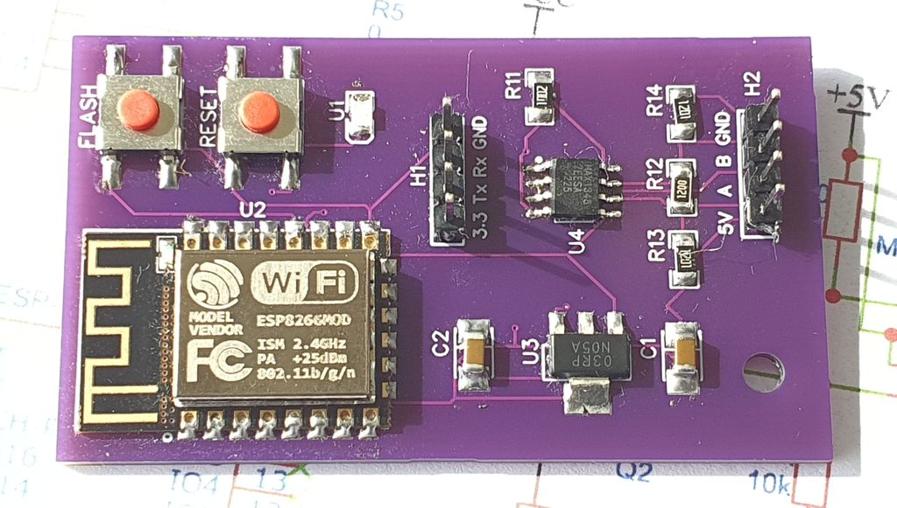
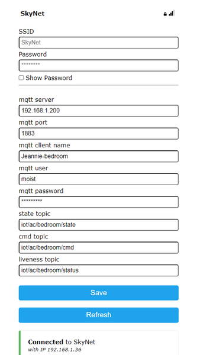
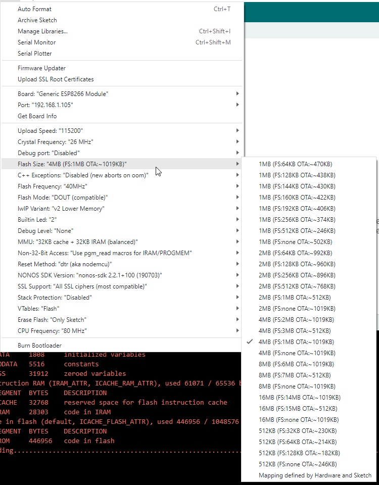

# jeannie
Arduino sketch for [ESP12F-based module](https://github.com/Vittaly76/Hisense-to-MQTT) to enable communication with Hisense AC via [MQTT protocol](https://en.wikipedia.org/wiki/MQTT).

This is an alternative firmware for the original module by [Vittaly76](https://github.com/Vittaly76).

The custom module is replacing original Hisense AEH-W4G2 module (or similar, like AEH-W4-1), and communicates to AC via [RS-485](https://en.wikipedia.org/wiki/RS-485) serial protocol.

# Hardware
Module schematics, BOM, PCB Gerber can be found here: [Vittaly76/Hisense-to-MQTT](https://github.com/Vittaly76/Hisense-to-MQTT).



# Features
- OTA support
- [WiFiManager](https://github.com/tzapu/WiFiManager)
- Logging over network with [WebSerial](https://github.com/ayushsharma82/WebSerial)

# Setup
After replacing original module, first configure it by connecting to WiFi hotspot `Jeannie-XXX` and opeing in browser `http://192.168.4.1`.
All parameters are self-describing and clear to understand.


Once correctly configured, the MQTT `status` topic should obtain `online` message, and `state` topic obtain a JSON with current AC-state:
```json
{
  "power": 0,
  "swing": 0,
  "mode": "cool",
  "targetTemp": 20,
  "currentTemp": 23,
  "pipeTemp": 20,
  "speed": 0,
  "settingsCelcius": 1,
  "mute": 0
}
```
The state gets updated every minute, or when some AC state changes are detected (for example when somebody uses remote control).

# LED feedback
The module's LED indicates current state
- Blinking interval 1000ms - Setup mode. WiFiManager is active and reachable over local IP-address, or hotspot over `192.168.4.1`
- Blinking interval 300ms - OTA mode activated. New firmware can be uploaded over air from Arduino studio.
- Blinking interval 3000ms - some error is detected.
- Single blink happens on every MQTT command arrived.

# Supported commands
Following commands can be sent to `cmd` topic:
- `set` - activate WiFiManager portal
- `ota` - activate OTA
- `rst` - restart module
- `sta` - force module to update `state` topic

Power control
- `power_on`
- `power_off`

Mode. 
- `mode_cool`
- `mode_heat`
- `mode_dry`
- `mode_fan`
- `mode_auto`

*Note: if AC is turned off, when mode change command arrives, the AC is automatically turned on by this firmware.*

Speed control. 
- `speed_auto`
- `speed_1`
- `speed_2`
- `speed_3`
- `speed_4`
- `speed_5`

*Note: if AC is turned off, when mode change command arrives, the AC is automatically turned on by this firmware.*

Temperature settings
- `temp_XX` - set temperature to `XX` degrees. Example `temp_22`.
- `temp+XX` - adjust temperature to `+XX` degrees. Example `temp+1`.
- `temp-XX` - adjust temperature to `-XX` degrees. Example `temp-2`.

Swing control
- `swing_on`
- `swing_off`

Evergy save mode
- `evergysave_on`
- `evergysave_off`

Boost mode
- `boost_on`
- `boost_off`

Quiet mode
- `quiet_on`
- `quiet_off`

Sleep mode
- `sleep_off`
- `sleep_1` - "general"
- `sleep_2` - "old"
- `sleep_3` - "young"
- `sleep_4` - "kid"

Mute internal AC beeper
- `mute_on` - activate silent mode. No beep feedback on incoming commands.
- `mute_off` - deactivate silent mode.

Celcius/Farenheit mode
- `celsius_on`
- `celsius_off`

# Arduino settings


# MQTT bridges integration
Not really part of the module or firmware, but here are configuration examples for my MQTT smart home bridges:
- Config example for [AlisaSmartHome.MQTT.bridge](https://github.com/ai91/AlisaSmartHome.MQTT.bridge): [alisasmarthome.mqtt.bridge.config.json](doc/alisasmarthome.mqtt.bridge.config.json)
- Config example for [AlexSmartHome.MQTT.bridge](https://github.com/ai91/AlexaSmartHome.MQTT.bridge): [alexasmarthome.mqtt.bridge.config.json](doc/alexasmarthome.mqtt.bridge.config.json)

[](https://youtu.be/p6C_MBKraxY)
